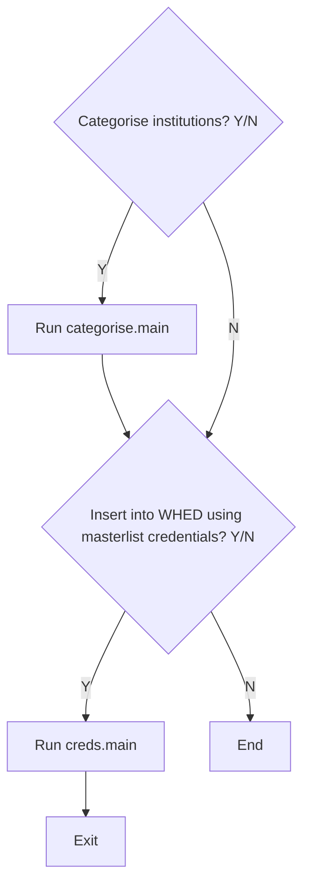

# WHED Inbound
This is the prototype for an API which will process Excel spreadsheets submitted from trusted credential
authorities. 

## Project Requirements
- Python
- Pip
- MySQL with a copy of the WHED
- A .env file containing connection details for the MySQL database
- A **masterlist.xlsx** file, containing institutional and credential information from a source (or a sample)

## Masterlist Explained

Your workbook should contain the following three spreadsheets. See **template.xlsx** for example source data.

### whed_levels sheet

Table defining all the degrees for a country. 
Should have the following columns in this order: 
- `ext_cred_name` - External credential name  
- `level_code` - ISCED education level
- `country_code` - ISO 3166-1 alpha-2
- `whed_cred_name`

### whed_inst sheet 

(**Note:** should not come from masterlist)

Table defining the institutions which are already in WHED. 
Should have the following columns in this order: 
- `WHED ID`
- `Global WHED ID`
- `Institution Name`
- `Name English`
- `Alternative Name`
- `Homepage`
- `Address concat`
- `Address: Street`
- `Address: City`
- `Address: Province`
- `Address: Post Code`
- `State`
- `Country`
- `Branch of`

### ext_inst sheet

List of the institutions from the recognised government or credential recognition body.
It should have the following columns in this order: 
- `row index`
- `institution ID`
- `institution name`
- `institution alternative name`
- `institution homepage`
- `concatenation of the institutional address`

### ext_cred sheet

List of the credentials offered.  
It should have the following columns in this order: 
- `institution ID`
- `institution name`
- `Expired` - whether credential is not expired (manually set this to "No" if it is not present in extraction)
- `Credential level` (i.e. Bachelors, Masters, or NQF level)
- `Course Name`
- `Course Code`
- `FOS Levels` - if available and in descending order of hierarchy

Diagram presenting the flow of program 



## Setup

Create and activate virtual environment, install requirements

```bash
python -m venv venv
source venv/bin/activate
pip install -r requirements.txt
```

Run the program 
```bash
python main.py
```
To deactivate virtual environmet use 
```bash
deactivate
```
